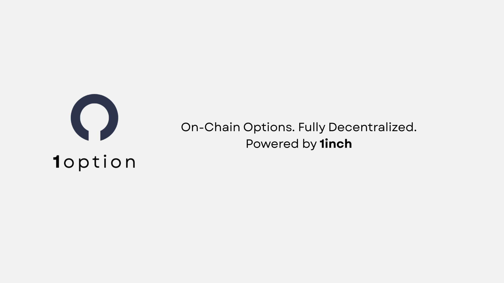

# Project Overview - 1option Protocol


> A decentralized, permissionless protocol for options built on the 1inch Limit Order Protocol

[](https://opensource.org/licenses/MIT)
[](https://hardhat.org/)
[](https://1inch.io/)



## Table of Contents

- [Overview](#-overview)
- [Key Features](#-key-features)
- [Architecture](#-architecture)
- [Prerequisites](#-prerequisites)
- [Development Setup](#-development-setup)
- [Project Structure](#-project-structure)

## Overview

**1option** is a decentralized, permissionless protocol that allows anyone to mint, buy, and exercise call options built on top of the 1inch Limit Order Protocol as a settlement layer. It leverages off-chain signatures, on-chain NFT minting, and tokenized collateral to create a new class of decentralized financial derivatives , without relying on a traditional order book model.

## Key Features

- **Decentralized Options Trading** - No centralized intermediaries
- **Collateralized Positions** - Fully backed by tokenized collateral  
- **Off-Chain Signatures** - Gas-efficient order matching
- **NFT-Based Options** - Each option is a unique NFT
- **1inch Integration** - Built on battle-tested infrastructure
- **Permissionless** - Anyone can participate

## Architecture

The protocol consists of three main components:

- **Smart Contracts** - Core protocol logic and NFT minting
- **Backend API** - Order management and matching
- **Frontend Interface** - User-friendly trading interface

## Development Setup

### Step 1: Clone & Install Dependencies

```bash
# Clone repository
git clone <repository-url>
cd limit-options-protocol

npm install
```

### Step 2: Start Local Blockchain
```bash
npx hardhat node
```

### Step 3: Deploy Smart Contracts
```bash
npm run deploy
```

### Step 4: Configure Frontend Environment
```bash
npm run setup:frontend-env
```

### Step 5: Initialize Demo Data
```bash
npx hardhat run complete-setup.js --network localhost
```

### Step 6: Start Backend Server
```bash
npm start
```

### Step 7: Launch Frontend Application
```bash
npm run frontend
```

## Project Structure

```
limit-options-protocol/
├── contracts/          # Solidity Smart contracts
├── frontend/           # React frontend application
├── backend/            # Node.js API server + Database
├── scripts/            # Deployment and utility scripts
├── test/               # Test files
└── external/           # External dependencies (1inch Limit Order Protocol contracts for local deployment)
```

## Live Demo - Deployed Base Sepolia Testnet Contracts Address

Live Demo URL : [1option.vercel.app](https://1option.vercel.app/)

Live Demo is currently performed on Base Sepolia Testnest, the following contracts below are being used. 

You may use the mock tokens to mint your own tokens to test the feature

```bash 
Limit Order Protocol = 0xC7433cC4c521F8e99986F00513f4a88eE9FF28CC
Option NFT = 0x3918BBBd2ED463Ea3849ccfdcCf0b4AD1f6C7145
Mock ETH = 0x1F8e0acB0a1A06De7E597e92cB250C84D925b8ba
Mock USDC = 0xD76910835C67BD138442744c6D080F92d009e6d6
Dummy Token = 0x7A501C90c7D9605f7BD42649585eD03D4c1757c7
```
### Base Sepolia Testnet Contract Addresses

Limit Order Protocol : https://sepolia.basescan.org/address/0xC7433cC4c521F8e99986F00513f4a88eE9FF28CC

Option NFT : https://sepolia.basescan.org/token/0x3918BBBd2ED463Ea3849ccfdcCf0b4AD1f6C7145

Test USDC: https://sepolia.basescan.org/address/0xD76910835C67BD138442744c6D080F92d009e6d6

Test wETH: https://sepolia.basescan.org/address/0x1F8e0acB0a1A06De7E597e92cB250C84D925b8ba

Dummy Token : https://sepolia.basescan.org/address/0x7A501C90c7D9605f7BD42649585eD03D4c1757c7
